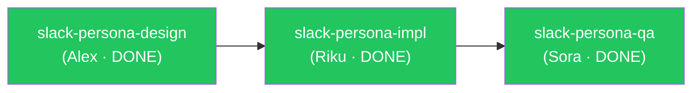

# Phase 2 Intelligence — 統合設計メモ

## 対象 Issue
- #12 DECISIONS.md（スプリント間記憶）
- #13 タスクリスク予測
- #14 Mermaid可視化
- #15 自動リトロスペクティブ

---

## 1. 全体アーキテクチャ

### 設計方針

4つの Issue はすべて「スプリント完了時に何かを生成・更新する」というライフサイクルを共有している。
既存の `subagent_stop.sh` のスプリント完了判定ブロック（`INCOMPLETE==0 && QA_PENDING==0`）を拡張ポイントとして使い、単一のフックから各機能を呼び出す設計とする。

```
スプリント完了トリガー（subagent_stop.sh）
  │
  ├── queue.sh retro         → リトロスペクティブ集計（#15）
  │     └── docs/retro/[sprint]-retro.md を生成
  │
  ├── queue.sh retro --decisions  → DECISIONS.md 追記（#12）
  │     └── docs/DECISIONS.md に追記
  │
  └── queue.sh graph         → Mermaid グラフ出力（#14）
        └── STDOUTに出力 or docs/design/[sprint]-graph.md に保存
```

リスク予測（#13）は「タスク着手前（`queue.sh start` 呼び出し時）」に動作するため、
スプリント完了フックとは独立したトリガーを持つ。

### 変更ファイル一覧

| ファイル | 変更種別 | 内容 |
|---------|---------|------|
| `scripts/queue.sh` | 追記 | `graph`、`retro` コマンドを追加 |
| `hooks/subagent_stop.sh` | 追記 | スプリント完了時に `retro` を自動実行 |
| `docs/DECISIONS.md` | 新規 | スプリント間記憶の永続ストア |
| `agents/pm.md` | 追記 | スプリント完了報告フォーマットの拡張、リスク判断基準 |

---

## 2. Issue #12 — DECISIONS.md（スプリント間記憶）

### ファイルパス

`docs/DECISIONS.md`

### フォーマット設計

```markdown
# DECISIONS — agent-crew

スプリント完了時に自動追記される判断・学習・失敗パターンの記録。
次スプリント計画時に Yuki が参照する。

---

## [sprint-id] — [完了日]

### アーキテクチャ判断
- [slug]: [判断の要点。なぜその設計を選んだか]

### 学び
- [再現可能な知見。次スプリントに活かせること]

### 失敗パターン
- [ブロック・リトライが発生したタスクと原因の要約]

### 次スプリントへの推奨
- [Yuki が次の計画時に検討すべきこと]

---
```

### 自動追記のデータソース

`_queue.json` の `events[]` と各タスクの `notes` フィールドから以下を抽出する。

| セクション | 抽出元 |
|-----------|--------|
| アーキテクチャ判断 | `assigned_to == "Alex"` のタスクの `summary` |
| 失敗パターン | `status == "BLOCKED"` または `retry_count > 0` のタスクの block/retry イベント |
| 学び | QA で `CHANGES_REQUESTED` が出たタスクの qa イベントメッセージ |
| 次スプリントへの推奨 | `status == "ON_HOLD"` のタスクの `notes` |

### 生成タイミング

`queue.sh retro` 実行時に `--decisions` フラグを付けると `docs/DECISIONS.md` に追記する。
`subagent_stop.sh` のスプリント完了ブロックからフラグ付きで自動呼び出しする。

---

## 3. Issue #13 — タスクリスク予測

### 設計方針

`queue.sh start <slug>` 実行時に `_queue.json` の既存 `risk_level` フィールドと
過去の `events[]` からリスクスコアを計算して警告を出す。
**キューの状態を変更しない（読み取り専用の評価）**。

### リスクスコア計算ロジック

```bash
# queue.sh start 内部で calculate_risk を呼ぶ
calculate_risk() {
  local slug=$1

  # 1. 自タスクの設定値から基礎スコア
  local base_risk
  base_risk=$(jq -r --arg s "$slug" '
    .tasks[] | select(.slug == $s) |
    (.risk_level // "low") + "|" + (.complexity // "S") + "|" + (.retry_count | tostring)
  ' "$QUEUE_FILE")

  # 2. 同一 assigned_to エージェントの直近ブロック回数（過去3スプリント分）
  local agent_block_count
  agent_block_count=$(jq -r --arg s "$slug" '
    .tasks[] | select(.slug == $s) | .assigned_to as $a |
    [.tasks[] | select(.assigned_to == $a) |
      .events[] | select(.action == "block")] | length
  ' "$QUEUE_FILE")
}
```

リスクレベルの判定マトリクス：

| risk_level（設定値） | complexity | retry_count > 0 | → 警告レベル |
|---------------------|-----------|-----------------|-------------|
| high | any | any | WARNING: HIGH RISK |
| medium | L | any | WARNING: HIGH RISK |
| medium | M/S | true | NOTICE: ELEVATED |
| low | L | true | NOTICE: ELEVATED |
| low | any | false | INFO: LOW RISK |

### 出力形式

`queue.sh start <slug>` 実行時に STDERR へ出力する（正常フローを邪魔しない）。

```
RISK: <slug> — HIGH RISK
  risk_level: high
  complexity: L
  retry_count: 1
  agent block history: Alex 2件
  推奨: オーナーに事前確認してから着手してください
```

### `risk_level` フィールドの自動推論（タスク作成時補助）

Yuki がタスク分解時に `risk_level` を設定していない場合、以下のデフォルト推論を `queue.sh` の `start` コマンドが代替する。

- `complexity: L` → `high`
- `complexity: M` → `medium`
- `complexity: S` → `low`

既存の `complexity` バリデーション（`cmd_start` 内の S/M/L チェック）の直後に挿入する。

---

## 4. Issue #14 — Mermaid 可視化

### コマンド仕様

```bash
queue.sh graph [<sprint>]
```

`_queue.json` の `tasks[].depends_on` と `tasks[].status` を読み取り、
Mermaid の `flowchart LR` 記法で STDOUT に出力する。

### 出力フォーマット

````markdown

````

### ステータス別スタイルマッピング

| status | classDef |
|--------|---------|
| DONE | done（緑） |
| IN_PROGRESS | in_progress（オレンジ） |
| BLOCKED | blocked（赤） |
| READY_FOR_* | ready（青） |
| TODO / ON_HOLD | todo（グレー） |

### jq 実装スケッチ

```bash
cmd_graph() {
  require_queue
  echo '```mermaid'
  echo 'flowchart LR'

  # ノード定義
  jq -r '.tasks[] |
    .slug as $s |
    (.status | ascii_downcase |
      if startswith("ready_for_") then "ready"
      elif . == "in_progress" then "in_progress"
      else . end
    ) as $cls |
    "  " + $s + "[\"" + $s + "\\n(" + (.assigned_to // "?") + " · " + .status + ")\"]:::" + $cls
  ' "$QUEUE_FILE"

  echo ""

  # エッジ定義
  jq -r '.tasks[] |
    .slug as $s |
    (.depends_on // [])[] as $dep |
    "  " + $dep + " --> " + $s
  ' "$QUEUE_FILE"

  echo ""
  echo "  classDef done fill:#22c55e,color:#fff"
  echo "  classDef in_progress fill:#f59e0b,color:#fff"
  echo "  classDef blocked fill:#ef4444,color:#fff"
  echo "  classDef ready fill:#3b82f6,color:#fff"
  echo "  classDef todo fill:#e5e7eb,color:#374151"
  echo '```'
}
```

### ファイル保存オプション

```bash
queue.sh graph --save
```

`--save` フラグを付けると `docs/design/[sprint]-graph.md` に保存する。
スプリント完了時に `subagent_stop.sh` から自動保存する。

---

## 5. Issue #15 — 自動リトロスペクティブ

### コマンド仕様

```bash
queue.sh retro [--save] [--decisions]
```

- `--save`: `docs/retro/[sprint]-retro.md` に保存
- `--decisions`: `docs/DECISIONS.md` に追記（#12と統合）

### 集計メトリクス

`_queue.json` の `events[]` と各フィールドから以下を算出する。

```
## スプリント: [sprint]

### タスク完了サマリー
| タスク | 担当 | complexity | 実行時間 | retry_count | qa_result |
|--------|------|-----------|---------|-------------|-----------|
| slug   | Riku | M         | 45分    | 0           | APPROVED  |

### 集計
- 完了タスク数: N
- ブロック発生: N件（スラッグ一覧）
- 総リトライ回数: N
- QA差し戻し率: N%（CHANGES_REQUESTED / 全QAタスク）

### Complexity 精度評価
| complexity | タスク数 | 平均実行時間 |
|-----------|---------|------------|
| S         | N       | XX分       |
| M         | N       | XX分       |
| L         | N       | XX分       |

> 実行時間は start → done イベント間の diff から算出

### ボトルネック
- 最もリトライが多かったタスク: [slug] (N回)
- 最も長かったタスク: [slug] (XX分)

### 次スプリントへの推奨アクション
- [自動生成ルールに基づく推奨]
```

### 推奨アクション自動生成ルール

| 条件 | 推奨文 |
|-----|-------|
| QA差し戻し率 > 30% | 「実装前の設計レビューを強化してください」 |
| ブロック発生 > 2件 | 「次スプリント計画時にリスクの高いタスクを先頭に置いてください」 |
| L complexity の実行時間が S の10倍超 | 「L タスクをさらに分割することを検討してください」 |
| retry_count の合計 > 総タスク数 * 0.5 | 「受け入れ基準をタスク分解時に明文化してください」 |

### 実行時間計算

`events[]` の `start` アクションと `done` アクションの `ts` 差分を使う。

```bash
# jq で start→done のタイムスタンプ差を分単位で取得
jq -r --arg s "$slug" '
  .tasks[] | select(.slug == $s) |
  (.events | map(select(.action == "start")) | last | .ts) as $start |
  (.events | map(select(.action == "done")) | last | .ts) as $done |
  # ISO8601 → epoch は jq では困難なため date コマンドに委譲
  $start + "|" + $done
' "$QUEUE_FILE"
```

実際の時間計算は `bash` の `date -d` または `date -j` を使う。

---

## 6. `queue.sh` への追加コマンド一覧

既存のヘッダーコメントに以下を追記する。

```
#   queue.sh graph [--save]                                      # Mermaid依存グラフを出力
#   queue.sh retro [--save] [--decisions]                        # リトロスペクティブ集計
```

ディスパッチテーブルへの追記：

```bash
  graph)  cmd_graph "$@" ;;
  retro)  cmd_retro "$@" ;;
```

---

## 7. `subagent_stop.sh` への追記

スプリント完了ブロック（`INCOMPLETE==0 && QA_PENDING==0` の分岐）内に以下を追加する。

```bash
# ---------- スプリント完了時の自動処理 ----------
SCRIPT_DIR="$(cd "$(dirname "${BASH_SOURCE[0]}")" && pwd)"
QUEUE_SH="${SCRIPT_DIR}/../scripts/queue.sh"

if [[ -x "$QUEUE_SH" ]]; then
  # リトロスペクティブ集計 + DECISIONS.md 追記 + グラフ保存
  "$QUEUE_SH" retro --save --decisions
  "$QUEUE_SH" graph --save
fi
```

追加位置: 現在の Slack 通知呼び出しの直後（exit 0 の前）。

---

## 8. `agents/pm.md` への追加セクション

### 追加セクション 1 — スプリント完了報告フォーマットの拡張

既存の「完了報告フォーマット」を以下に置き換える（追記のみ）。

```markdown
## スプリント完了報告 — [sprint名]

### 完了タスク
- [slug]: [一言説明]

### リトロスペクティブサマリー
> `scripts/queue.sh retro` の出力を貼り付ける

### 残課題・技術的負債
- [あれば記載]

### DECISIONS.md 更新内容
- [今スプリントで追記した判断・学びの要点]

### 次のスプリントの候補
- [提案があれば]
```

### 追加セクション 2 — スプリント開始時の DECISIONS.md 参照

「スプリント計画フォーマット」セクションの前に以下を追加する。

```markdown
## スプリント開始前チェック

新スプリントを計画する前に `docs/DECISIONS.md` を確認し、
前スプリントの失敗パターンと推奨アクションをタスク設計に反映する。

確認ポイント：
- 直前スプリントの「失敗パターン」に同種のタスクがないか
- 「次スプリントへの推奨」で指摘された事項に対処したか
- risk_level: high のタスクを最初のフェーズに配置したか
```

### 追加セクション 3 — risk_level 設定ガイド

「複雑度見積もり（complexity）」セクションの後に追加する。

```markdown
## リスクレベル設定（risk_level）

タスク分解時に各タスクの `risk_level` を設定する。
設定しない場合は `complexity` から自動推論される（S→low / M→medium / L→high）。

| 値 | 定義 |
|----|------|
| `low` | 既存パターンの踏襲。失敗しても影響が限定的 |
| `medium` | 新しい統合・API境界の変更を含む |
| `high` | アーキテクチャ変更・外部依存の新規追加・セキュリティ関連 |

### 強制 high にすべきケース

- DBスキーマの破壊的変更
- 外部 Webhook / API の新規連携
- エージェント間プロトコル（queue.sh のスキーマ）変更
- 過去に2回以上ブロックされたパターンと同種のタスク
```

---

## 9. トレードオフ分析

### 設計オプション比較

| 観点 | 選択した設計 | 代替案 | 棄却理由 |
|-----|------------|-------|---------|
| リトロ生成タイミング | subagent_stop.sh から自動呼び出し | Yuki が手動で `queue.sh retro` を実行 | 人間依存のステップを増やしたくない |
| DECISIONS.md の記録粒度 | スプリント単位で追記 | タスク完了ごとに追記 | 頻繁な更新で可読性が下がる。スプリント単位が適切 |
| グラフ出力形式 | Mermaid（flowchart LR）| DOT言語 / PlantUML | GitHub Markdown がネイティブで Mermaid をレンダリングする。追加ツール不要 |
| リスク予測のデータソース | 現スプリントの _queue.json のみ | 過去スプリントのアーカイブJSON | アーカイブ機構が未実装。DECISIONS.md を人間可読な代替記録として使う |

### 変更の影響範囲

- `queue.sh` に `graph` / `retro` を追加するが、既存コマンドは無変更。後方互換を維持。
- `subagent_stop.sh` への追記は `queue.sh` の存在確認つき（`-x` チェック）のため、スクリプト不在でも既存動作は壊れない。
- `_queue.json` のスキーマ変更は不要。`risk_level` は既存フィールドを活用。

---

## 10. 実装順序（Riku への引き継ぎ推奨順）

1. `queue.sh graph` — 依存関係が最も少なく、既存 `show` コマンドのパターンをそのまま流用できる。最初に実装してグラフを確認しながら他の機能を設計できる。
2. `queue.sh retro` の集計部分（`--save` なし）— STDOUT 出力だけなら副作用がない。テストしやすい。
3. `--save` と `--decisions` フラグ — ファイル書き込みを伴う。2が固まってから。
4. `subagent_stop.sh` への自動呼び出し追記 — 3が完成してから統合。
5. `queue.sh start` へのリスク警告追加 — 既存の complexity バリデーションブロックの直後に挿入。

---

## 11. Sora（QA）への確認ポイント

- `queue.sh retro` の実行時間計算で `date -j`（macOS）と `date -d`（Linux）の差異を吸収しているか
- `graph --save` で `docs/design/` ディレクトリが存在しない場合の `mkdir -p` 処理
- `DECISIONS.md` への追記が冪等か（同一スプリントを2回 retro した場合に重複しないか）
