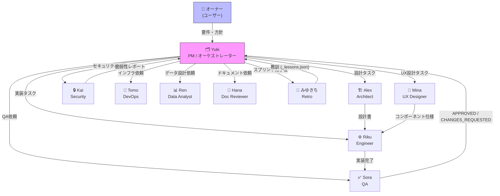
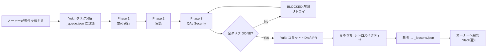
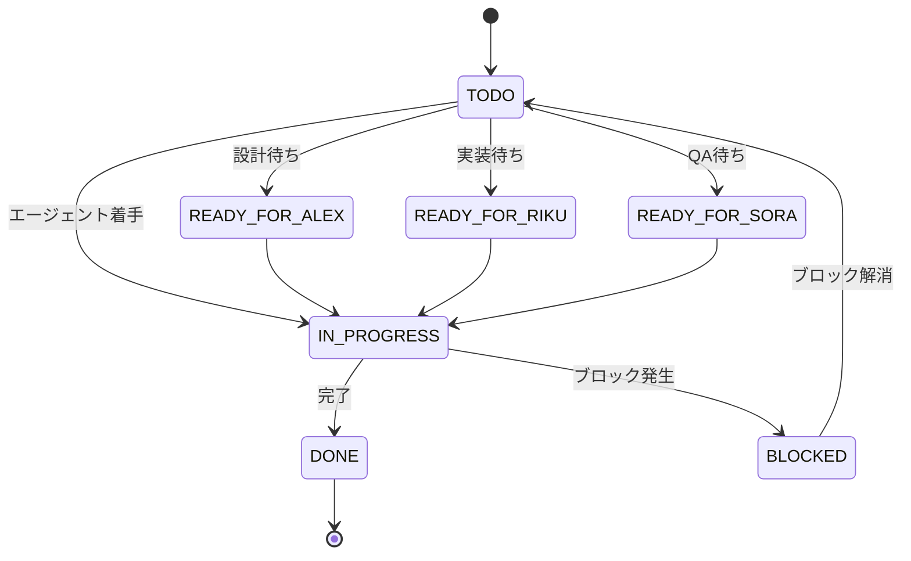
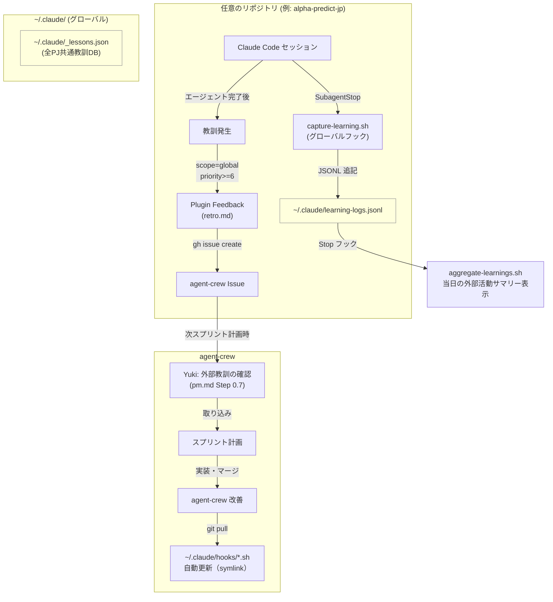
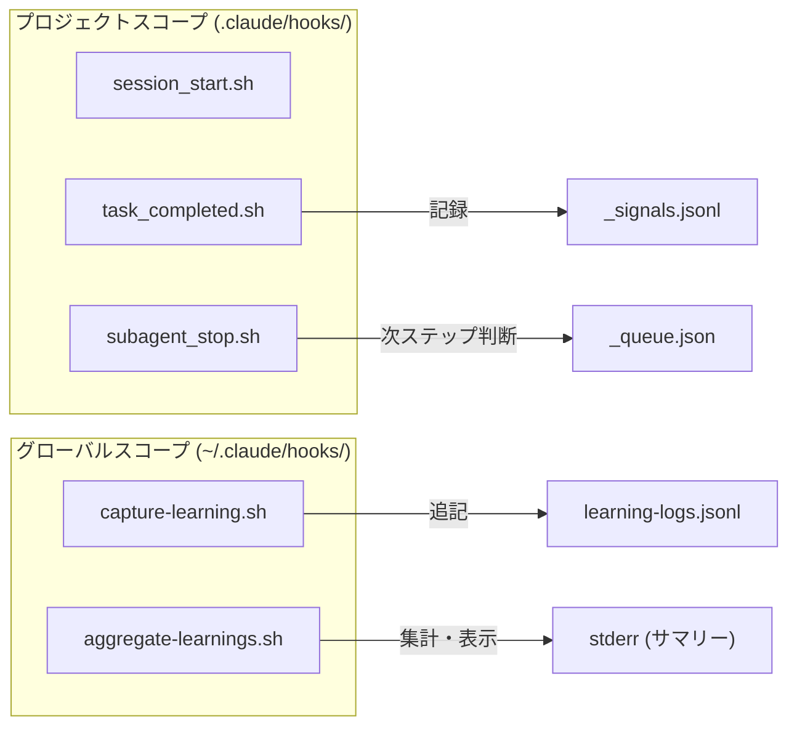
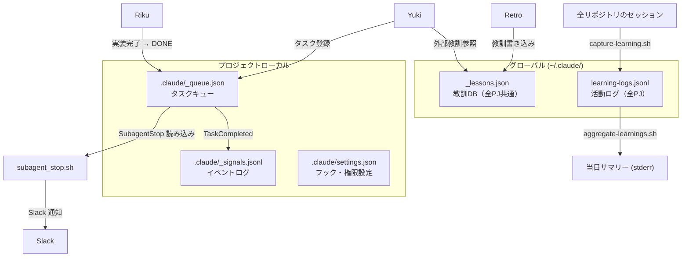
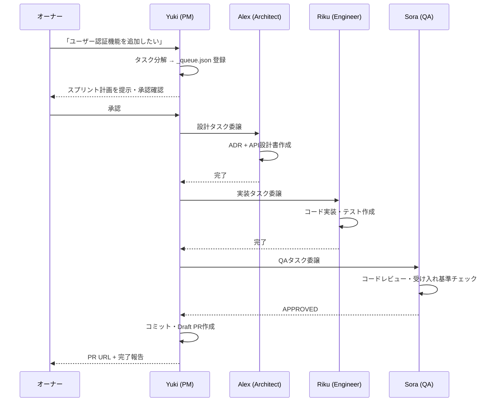
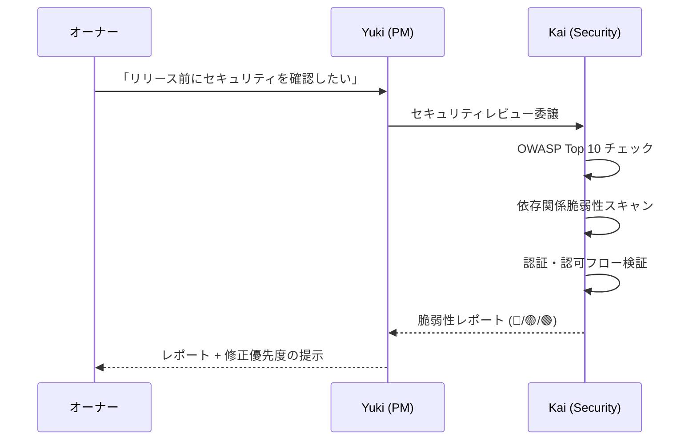
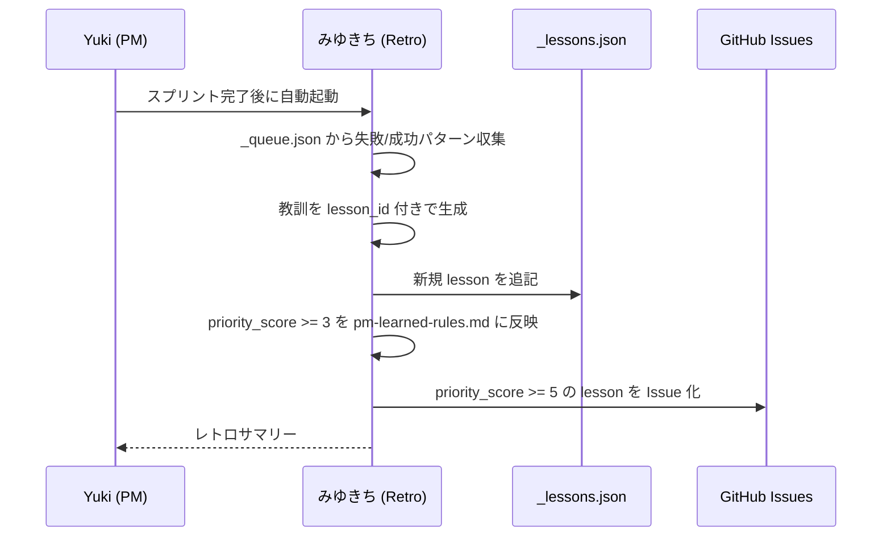

# agent-crew アーキテクチャガイド

> バージョン: Sprint-22 時点 (2026-06-15)  
> 対象読者: このリポジトリを初めて読む開発者・agent-crew を別プロジェクトへ展開する人

---

## 目次

1. [概要](#1-概要)
2. [エージェント一覧と関係図](#2-エージェント一覧と関係図)
3. [スプリントライフサイクル](#3-スプリントライフサイクル)
4. [自律成長ループ（クロスリポジトリ）](#4-自律成長ループクロスリポジトリ)
5. [フック・イベント設計](#5-フックイベント設計)
6. [データフロー](#6-データフロー)
7. [スキル・プラグイン構成](#7-スキルプラグイン構成)
8. [ユースケース別使用例](#8-ユースケース別使用例)
9. [ファイル構成リファレンス](#9-ファイル構成リファレンス)

---

## 1. 概要

agent-crew は **個人開発者がひとりで複数のAIエージェントを動かしてソフトウェアを開発するための Claude Code プラグイン**です。

PM・設計・実装・QA・セキュリティ・DevOps・データ分析・ドキュメントレビューの各専門エージェントが、スクラムライクなスプリントサイクルで協調動作します。スプリント終了後は教訓を自動蓄積し、クロスリポジトリで知見を共有する「自律成長ループ」が動作します。

### 設計思想

| 原則 | 内容 |
|------|------|
| **介入最小化** | オーナーは「何を作るか」を伝えるだけ。手順・承認・コミットは自動 |
| **専門分化** | 各エージェントは1つの責務のみを持つ（PM は実装しない・Riku は設計しない） |
| **学習継続** | 失敗も成功も教訓として記録し、次のスプリントに自動反映 |
| **プラグイン配布** | `claude plugin install github:Andryu/agent-crew` で他プロジェクトへ即展開 |

---

## 2. エージェント一覧と関係図

### エージェント一覧

| ペルソナ | ファイル | 役割 | ツール権限 |
|---------|---------|------|-----------|
| **Yuki** (PM) | `pm.md` | 統括・タスク分解・委譲・Slack通知 | Read/Write/Bash/Glob/WebSearch |
| **Alex** (Architect) | `architect.md` | システム設計・ADR・DB設計 | Read/Write/Glob/Grep/Bash |
| **Mina** (UX) | `ux-designer.md` | UXフロー・ワイヤーフレーム・コンポーネント仕様 | Read/Write/Glob |
| **Riku** (Engineer) | `engineer-go.md` / `engineer-vue.md` / `engineer-next.md` | 実装・テスト | Read/Write/Edit/Bash/Glob/Grep |
| **Sora** (QA) | `qa.md` | コードレビュー・受け入れ基準チェック | Read/Grep/Glob/Bash（読み取り専用） |
| **Kai** (Security) | `security.md` | OWASP/脆弱性スキャン | Read/Grep/Glob/Bash（読み取り専用） |
| **Tomo** (DevOps) | `devops.md` | CI/CD・Docker・デプロイ | Read/Write/Edit/Bash/Glob/Grep |
| **Ren** (Data) | `data-analyst.md` | データパイプライン・SQL・ダッシュボード | Read/Write/Edit/Bash/Glob/Grep |
| **Hana** (DocReview) | `doc-reviewer.md` | PRD・仕様書・README レビュー | Read/Grep/Glob（読み取り専用） |
| **みゆきち** (Retro) | `retro.md` | 振り返り・教訓記録・Issue化 | Read/Write/Bash/Glob |

### エージェント関係図



### 並列実行ルール

同一 `parallel_group` に属し、`depends_on` が全て DONE のタスクは並列委譲できます。

```mermaid
gantt
    title スプリント並列実行例
    dateFormat X
    axisFormat %s

    section Phase 1（並列）
    Alex: 設計        :a1, 0, 3
    Mina: UX設計      :a2, 0, 2

    section Phase 2（直列）
    Riku: 実装        :b1, after a1, 5

    section Phase 3（並列）
    Sora: QA          :c1, after b1, 2
    Kai:  セキュリティ :c2, after b1, 2
```



---

## 3. スプリントライフサイクル

### ステップ全体図



### タスクステータス遷移



### `_queue.json` スキーマ（主要フィールド）

```json
{
  "sprint": "sprint-22",
  "tasks": [
    {
      "slug": "my-task",
      "title": "タスクタイトル",
      "status": "TODO",
      "assigned_to": "Riku",
      "complexity": "M",
      "risk_level": "medium",
      "parallel_group": "phase-1",
      "depends_on": ["another-task"],
      "qa_mode": "inline",
      "qa_result": null,
      "notes": "実装の詳細・前提条件"
    }
  ]
}
```

---

## 4. 自律成長ループ（クロスリポジトリ）

agent-crew の最も特徴的な仕組みです。どのリポジトリで作業しても教訓が蓄積され、agent-crew 自身の改善に使われます。

### 全体フロー



### 教訓のスコープ分類

| scope | 対象 | 主な用途 |
|-------|------|---------|
| `project` | 特定リポジトリ専用 | そのリポジトリの次スプリントに反映 |
| `stack` | 同技術スタック共通 | Go / Vue / Next ごとの知見共有 |
| `global` | 全PJ共通 | agent-crew 本体への改善フィードバック |

### `_lessons.json` スキーマ

```json
{
  "lesson_id": "alpha-sprint-01-process-001",
  "title": "教訓タイトル",
  "scope": "global",
  "priority_score": 7,
  "source_repo": "git@github.com:Andryu/alpha-predict-jp.git",
  "issue_url": null,
  "tags": ["process", "hook"]
}
```

---

## 5. フック・イベント設計

### フック一覧

| イベント | スクリプト | 場所 | 役割 |
|---------|-----------|------|------|
| `SessionStart` | `session_start.sh` | `.claude/hooks/` | 未完了タスク・直近 lesson の表示 |
| `TaskCompleted` | `task_completed.sh` | `.claude/hooks/` | `_signals.jsonl` にシグナル emit |
| `SubagentStop` | `subagent_stop.sh` | `.claude/hooks/` | 次ステップ提示・スプリント完了宣言 |
| `SubagentStop` | `capture-learning.sh` | `~/.claude/hooks/` | 全PJ の活動を `learning-logs.jsonl` に記録 |
| `Stop` | `aggregate-learnings.sh` | `~/.claude/hooks/` | 当日の外部リポジトリ活動サマリーを出力 |
| `Stop` | `privacy-check.sh` | `scripts/` | 変更ファイルの個人情報パターンスキャン |

### フックのスコープ



### Stop フックでのプライバシーチェック（`.claude/settings.json`）

コミット前に自動で個人情報パターンを検出します。

```
検出パターン:
  - メールアドレス (@ を含む文字列)
  - 絶対パス (/Users/<name>/)
  - Slack Webhook URL
  - GitHub PAT (ghp_)
  - OpenAI / Anthropic API キー
  - 日本の電話番号
```

---

## 6. データフロー

### 主要ファイルとデータ流れ



---

## 7. スキル・プラグイン構成

### プラグイン構成

```
agent-crew/
├── .claude-plugin/
│   ├── plugin.json          ← プラグインマニフェスト
│   └── marketplace.json     ← マーケットプレイス登録情報
├── .claude/
│   ├── agents/              ← エージェント定義（pm.md, qa.md...）
│   ├── skills/              ← スキル定義
│   │   ├── life-planner/
│   │   ├── life-plan-review/
│   │   └── privacy-audit/
│   └── hooks/               ← プロジェクトスコープのフック
└── scripts/                 ← ユーティリティスクリプト
```

### スキル一覧

| スキル | 呼び出し | 用途 |
|--------|---------|------|
| `life-planner` | `/life-planner` | ライフプラン（資産・保険・老後）初回作成 |
| `life-plan-review` | `/life-plan-review` | ライフプラン定期見直し |
| `privacy-audit` | `/privacy-audit` | リポジトリ全体の個人情報・機密情報スキャン |

### インストール方法

```bash
# Claude Code プラグインとして（推奨）
claude plugin install github:Andryu/agent-crew

# 手動セットアップ（開発・カスタマイズ用）
git clone https://github.com/Andryu/agent-crew ~/Workspace/agent-crew
cd ~/Workspace/agent-crew
bash install.sh go /path/to/my-project   # go/vue/next を選択

# グローバルフック（クロスリポジトリ学習）の有効化
bash install.sh --only=global-hooks go .
```

### マルチスタック対応

```
go   → engineer-go.md を riku.md としてコピー
vue  → engineer-vue.md を riku.md としてコピー
next → engineer-next.md を riku.md としてコピー
```

---

## 8. ユースケース別使用例

### ユースケース A: 新機能を1スプリントで開発する

**トリガー**: 「Yukiに〇〇を実装する計画を立てて」



---

### ユースケース B: セキュリティレビューを実施する

**トリガー**: 「Kaiにセキュリティレビューしてもらって」



---

### ユースケース C: 別リポジトリに agent-crew を展開する

**例**: `alpha-predict-jp` に株式分析エージェントを追加する

```bash
# 1. セットアップ（agent-crew を使って対象PJに設定を流す）
bash ~/Workspace/agent-crew/scripts/setup-sprint.sh \
  ~/Workspace/alpha-predict-jp sprint-1

# 2. プロジェクト固有スキルを直接作成
mkdir -p ~/Workspace/alpha-predict-jp/.claude/skills/jp-stock-analyst
# SKILL.md を作成（claude /skill-creator で作成補助も可）

# 3. スプリント開始
# → session_start.sh が自動実行され未完了タスクを表示
# → agent-crew の全エージェント（Yuki/Alex/Riku/Sora...）が利用可能
```

---

### ユースケース D: 自動プライバシーチェック

**仕組み**: Stop フックで自動実行（手動実行も可）

```bash
# 手動実行
/privacy-audit

# または自動: セッション終了時に差分ファイルをスキャン
# 検出時のみ警告出力（終了コード 0 で続行）
```

---

### ユースケース E: クロスリポジトリ学習の確認

```bash
# 当日のクロスリポジトリ活動を確認
cat ~/.claude/learning-logs.jsonl | \
  jq -r 'select(.ts | startswith("2026-06-15")) | "\(.repo) [\(.agent_type)]"'

# agent-crew 以外の教訓を確認
jq '[.lessons[] | select(.source_repo != "agent-crew" and .scope == "global")]' \
  ~/.claude/_lessons.json
```

---

### ユースケース F: レトロスペクティブ（スプリント振り返り）

**トリガー**: 「みゆきちを呼んで」または Yuki がスプリント完了後に自動起動



---

## 9. ファイル構成リファレンス

```
agent-crew/
│
├── .claude-plugin/
│   ├── plugin.json               プラグインマニフェスト
│   └── marketplace.json          マーケットプレイス登録情報
│
├── .claude/
│   ├── agents/
│   │   ├── pm.md                 Yuki — PM オーケストレーター
│   │   ├── pm-protocol.md        委譲ルール・QAモード補助定義
│   │   ├── pm-estimation.md      複雑度・見積もり補助定義
│   │   ├── pm-learned-rules.md   スプリントから蓄積した学習ルール
│   │   ├── architect.md          Alex — アーキテクト
│   │   ├── ux-designer.md        Mina — UX デザイナー
│   │   ├── engineer-go.md        Riku (Go スタック)
│   │   ├── engineer-vue.md       Riku (Vue3 スタック)
│   │   ├── engineer-next.md      Riku (Next.js スタック)
│   │   ├── qa.md                 Sora — QA・コードレビュー
│   │   ├── security.md           Kai — セキュリティレビュー
│   │   ├── devops.md             Tomo — DevOps・インフラ
│   │   ├── data-analyst.md       Ren — データ分析
│   │   ├── doc-reviewer.md       Hana — ドキュメントレビュー
│   │   └── retro.md              みゆきち — レトロスペクティブ
│   │
│   ├── skills/
│   │   ├── life-planner/         SKILL.md — ライフプラン初回作成
│   │   ├── life-plan-review/     SKILL.md — ライフプラン定期見直し
│   │   └── privacy-audit/        SKILL.md — 個人情報スキャン
│   │
│   ├── hooks/
│   │   ├── session_start.sh      SessionStart: 未完了タスク・lesson 表示
│   │   ├── task_completed.sh     TaskCompleted: _signals.jsonl emit
│   │   └── subagent_stop.sh      SubagentStop: 次ステップ提示・Slack通知
│   │
│   ├── _queue.json               現スプリントのタスクキュー
│   ├── _signals.jsonl            タスクイベントログ
│   └── settings.json             Claude Code 権限・フック設定
│
├── scripts/
│   ├── capture-learning.sh       グローバルSubagentStop: 活動ログ記録
│   ├── aggregate-learnings.sh    グローバルStop: 外部活動サマリー表示
│   ├── privacy-check.sh          個人情報パターンスキャン（Stop フック）
│   ├── setup-sprint.sh           別リポジトリへのスプリント機能展開
│   ├── propose-lesson-rules.sh   教訓 → pm-learned-rules.md 反映提案
│   ├── lessons.sh                _lessons.json 操作ユーティリティ
│   └── queue.sh / queue.py       _queue.json 操作ユーティリティ
│
├── docs/
│   ├── architecture.md           ← このファイル
│   ├── adr/                      アーキテクチャ決定記録 (ADR-001〜013)
│   ├── spec/                     設計仕様書
│   └── DECISIONS.md              スプリントごとの判断記録
│
├── templates/
│   ├── _queue.json               新規プロジェクト用キューテンプレート
│   └── settings.json             新規プロジェクト用設定テンプレート
│
└── install.sh                    セットアップスクリプト
```

### グローバルファイル（`~/.claude/`）

```
~/.claude/
├── agents/          グローバルエージェント（install.sh でコピー）
├── skills/          グローバルスキル（install.sh でシンボリックリンク）
├── hooks/
│   ├── capture-learning.sh   → agent-crew/scripts/capture-learning.sh
│   └── aggregate-learnings.sh → agent-crew/scripts/aggregate-learnings.sh
├── _lessons.json    全プロジェクト共通の教訓DB
├── learning-logs.jsonl  全プロジェクトの活動ログ
└── settings.json    グローバル設定（フック登録・権限）
```

---

*このドキュメントは agent-crew の主要コンポーネントが揃った Sprint-22 時点のスナップショットです。アーキテクチャの変更は `docs/adr/` に ADR として記録されます。*
