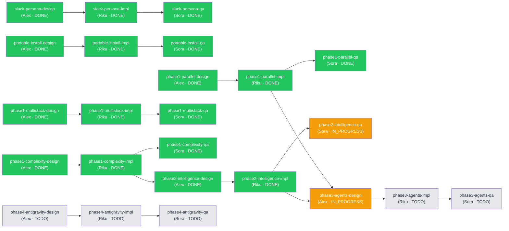

# sprint-02 — Mermaid依存グラフ

```mermaid
flowchart LR
  slack-persona-design["slack-persona-design\n(Alex · DONE)"]:::done
  slack-persona-impl["slack-persona-impl\n(Riku · DONE)"]:::done
  slack-persona-qa["slack-persona-qa\n(Sora · DONE)"]:::done
  portable-install-design["portable-install-design\n(Alex · DONE)"]:::done
  portable-install-impl["portable-install-impl\n(Riku · DONE)"]:::done
  portable-install-qa["portable-install-qa\n(Sora · DONE)"]:::done
  phase1-parallel-design["phase1-parallel-design\n(Alex · DONE)"]:::done
  phase1-parallel-impl["phase1-parallel-impl\n(Riku · DONE)"]:::done
  phase1-parallel-qa["phase1-parallel-qa\n(Sora · DONE)"]:::done
  phase1-multistack-design["phase1-multistack-design\n(Alex · DONE)"]:::done
  phase1-multistack-impl["phase1-multistack-impl\n(Riku · DONE)"]:::done
  phase1-multistack-qa["phase1-multistack-qa\n(Sora · DONE)"]:::done
  phase1-complexity-design["phase1-complexity-design\n(Alex · DONE)"]:::done
  phase1-complexity-impl["phase1-complexity-impl\n(Riku · DONE)"]:::done
  phase1-complexity-qa["phase1-complexity-qa\n(Sora · DONE)"]:::done
  phase2-intelligence-design["phase2-intelligence-design\n(Alex · DONE)"]:::done
  phase2-intelligence-impl["phase2-intelligence-impl\n(Riku · DONE)"]:::done
  phase2-intelligence-qa["phase2-intelligence-qa\n(Sora · IN_PROGRESS)"]:::in_progress
  phase3-agents-design["phase3-agents-design\n(Alex · IN_PROGRESS)"]:::in_progress
  phase3-agents-impl["phase3-agents-impl\n(Riku · TODO)"]:::todo
  phase3-agents-qa["phase3-agents-qa\n(Sora · TODO)"]:::todo
  phase4-antigravity-design["phase4-antigravity-design\n(Alex · TODO)"]:::todo
  phase4-antigravity-impl["phase4-antigravity-impl\n(Riku · TODO)"]:::todo
  phase4-antigravity-qa["phase4-antigravity-qa\n(Sora · TODO)"]:::todo

  slack-persona-design --> slack-persona-impl
  slack-persona-impl --> slack-persona-qa
  portable-install-design --> portable-install-impl
  portable-install-impl --> portable-install-qa
  phase1-parallel-design --> phase1-parallel-impl
  phase1-parallel-impl --> phase1-parallel-qa
  phase1-multistack-design --> phase1-multistack-impl
  phase1-multistack-impl --> phase1-multistack-qa
  phase1-complexity-design --> phase1-complexity-impl
  phase1-complexity-impl --> phase1-complexity-qa
  phase1-complexity-impl --> phase2-intelligence-design
  phase2-intelligence-design --> phase2-intelligence-impl
  phase2-intelligence-impl --> phase2-intelligence-qa
  phase1-parallel-impl --> phase3-agents-design
  phase2-intelligence-impl --> phase3-agents-design
  phase3-agents-design --> phase3-agents-impl
  phase3-agents-impl --> phase3-agents-qa
  phase4-antigravity-design --> phase4-antigravity-impl
  phase4-antigravity-impl --> phase4-antigravity-qa

  classDef done fill:#22c55e,color:#fff
  classDef in_progress fill:#f59e0b,color:#fff
  classDef blocked fill:#ef4444,color:#fff
  classDef ready fill:#3b82f6,color:#fff
  classDef todo fill:#e5e7eb,color:#374151
```
